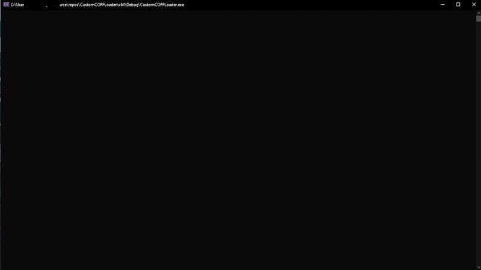

# COFF-Loader

This is a reimplementation of [TrustedSec COFF Loader](https://github.com/trustedsec/COFFLoader). I decided to create this repo to challenge my understanding of the Windows PE Format. This technique was originally used in [Cobalt Strike](https://www.cobaltstrike.com/). This project utilizes Visual Studio 2022 for those who wish to employ the VS Debugger and trace the execution of its memory operations loader.

While coding this I mainly used the following resources:
- [Microsoft PE Format](https://learn.microsoft.com/en-us/windows/win32/debug/pe-format)
- [Otterhacker's COFF Loader Article](https://otterhacker.github.io/Malware/CoffLoader.html)

## Usage

```
COFFLoader.exe <function name> <COFF file path>
```

The `function name` is the name BOF function entry name. This is typically `"go"`

Example:
```shell
COFFLoader.exe "go" C:\Github\COFF-Loader\BOF\test64.out
```

### BOF Arguments
In order to pass arguments to the BOF I used the exact same code that [Otterhacker's COFF Loader](https://github.com/OtterHacker/CoffLoader) uses. The struct is as follows:

```C
typedef struct _Arg {
    char* value;
    size_t size;
    BOOL includeSize;
} Arg;
```

You can see an example of this used [here](./Src/main.cpp) on line 25.

## Example

In the example below I used the BOF file that I modified from [TrustedSec BOF example](https://github.com/trustedsec/COFFLoader/blob/main/test.c). This simple BOF shows that the COFF loader was able to successfully was able to relocate all the symbols in different formats. Included in this  I included the modified BOF in `BOF/test.c` directory. You can use the make file to compile it with gcc or run the following command:

```shell
x86_64-w64-mingw32-gcc -c test.c -o test64.out
```



### References
- [Microsoft PE Format](https://learn.microsoft.com/en-us/windows/win32/debug/pe-format)
- THIS IS AN AMAZING BLOG WRITE UP --> [Otterhacker COFF Loader Article](https://otterhacker.github.io/Malware/CoffLoader.html)
- [TrustedSec COFFLoader](https://github.com/trustedsec/COFFLoader)
- [TrustedSec Situational Awareness BOF Repo](https://github.com/trustedsec/CS-Situational-Awareness-BOF)
- [Otterhacker COFF Loader Repo](https://github.com/OtterHacker/CoffLoader)
- [Cobalt Strike BOF C API](https://hstechdocs.helpsystems.com/manuals/cobaltstrike/current/userguide/content/topics/beacon-object-files_bof-c-api.htm)
- [Video to GIF](https://ezgif.com/video-to-gif)

