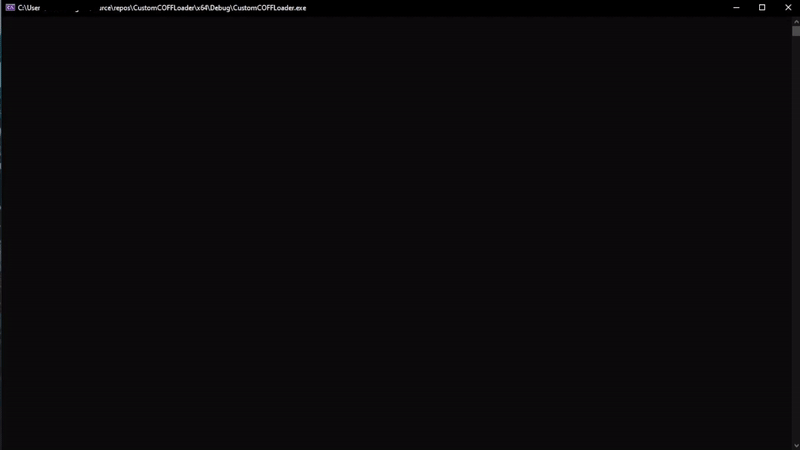

# COFF-Loader

This is a reimplementation of [TrustedSec COFF Loader](https://github.com/trustedsec/COFFLoader). I decided to create this repo to challenge my understanding of the Windows PE Format. This technique was originally used in [Cobalt Strike](https://www.cobaltstrike.com/). This project utilizes Visual Studio 2022 for those who wish to employ the VS Debugger and trace the execution of its memory operations loader.

While coding this I mainly used the following resources:
- [Microsoft PE Format](https://learn.microsoft.com/en-us/windows/win32/debug/pe-format)
- [Otterhacker's COFF Loader Article](https://otterhacker.github.io/Malware/CoffLoader.html)

## Download

A pre-built `COFFLoader.exe` is available from the latest [GitHub Actions run](https://github.com/Ap3x/COFF-Loader/actions). Go to the most recent successful run and download the `COFFLoader` artifact.

## Building

### Prerequisites
- Visual Studio 2022 (with C++ workload)
- CMake (included with Visual Studio)

### Build

```shell
cmake -B build -G "Visual Studio 17 2022" -A x64
cmake --build build --config Release
```

This builds:
- `build/Release/COFFLoader.exe` — the COFF loader
- `build/bofs/*.obj` — all BOF object files from the [Beacon-Object-File-Library](https://github.com/Ap3x/Beacon-Object-File-Library) submodule

> **Note:** If you cloned this repo, make sure to initialize the submodule:
> ```shell
> git submodule update --init --recursive
> ```

## Usage

```
COFFLoader.exe <function name> <COFF file path>
```

The `function name` is the BOF function entry name. This is typically `"go"`.

### Examples

```shell
# Run WhoAmI BOF
COFFLoader.exe go build\bofs\WhoAmI.obj

# Run Ipconfig BOF
COFFLoader.exe go build\bofs\Ipconfig.obj

# Run EnumDeviceDrivers BOF
COFFLoader.exe go build\bofs\EnumDeviceDrivers.obj

# Run GetSystemDirectory BOF
COFFLoader.exe go build\bofs\GetSystemDirectory.obj
```

### Included BOFs

The following BOFs are built from the [Beacon-Object-File-Library](https://github.com/Ap3x/Beacon-Object-File-Library) submodule:

| BOF | Description |
|-----|-------------|
| WhoAmI | Gets the current username |
| EnumDeviceDrivers | Enumerates loaded device drivers |
| GetSystemDirectory | Gets the system directory path |
| Ipconfig | Lists network adapter configurations |
| FileExfiltrationUrlEncoded | URL-encoded file exfiltration |
| RegistryPersistence | Registry-based persistence |
| TimeStomp | Modifies file timestamps |

### BOF Arguments
In order to pass arguments to the BOF I used the exact same code that [Otterhacker's COFF Loader](https://github.com/OtterHacker/CoffLoader) uses. The struct is as follows:

```C
typedef struct _Arg {
    char* value;
    size_t size;
    BOOL includeSize;
} Arg;
```

You can see an example of this used [here](./Src/main.cpp) on line 25.

## Example



### References
- [Microsoft PE Format](https://learn.microsoft.com/en-us/windows/win32/debug/pe-format)
- THIS IS AN AMAZING BLOG WRITE UP --> [Otterhacker COFF Loader Article](https://otterhacker.github.io/Malware/CoffLoader.html)
- [TrustedSec COFFLoader](https://github.com/trustedsec/COFFLoader)
- [TrustedSec Situational Awareness BOF Repo](https://github.com/trustedsec/CS-Situational-Awareness-BOF)
- [Otterhacker COFF Loader Repo](https://github.com/OtterHacker/CoffLoader)
- [Cobalt Strike BOF C API](https://hstechdocs.helpsystems.com/manuals/cobaltstrike/current/userguide/content/topics/beacon-object-files_bof-c-api.htm)
